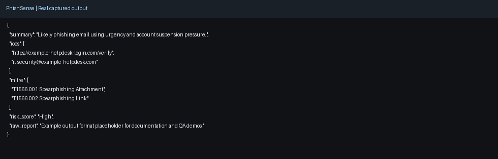
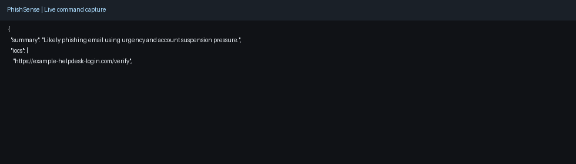

# PhishSense

A local phishing analysis utility for rapid IOC extraction and analyst-focused risk scoring.

## Why this project

- **Impact:** Improves phishing triage speed with structured and repeatable analysis output.
- **Scale:** Runs locally and supports JSON workflows for analyst tooling and automation.
- **Use case:** SOC inbox triage, phishing investigations, and threat reporting.

## Demo media

- Screenshot: 
- Demo GIF: 

## Capability snapshot

- IOC extraction from suspicious email content
- ATT&CK mapping suggestions for analyst context
- Risk scoring and report-friendly output

## Security Guardrails

PhishSense includes built-in AI safety and security controls to prevent misuse, injection, or unsafe LLM output.

📘 [View Security Guardrails and Analyst Briefing](SECURITY_GUARDRAILS.md)

## Requirements

- 🖥️ Python 3.8+
- 🦙 [Ollama](https://ollama.com) installed and running locally
- 💾 LLM model pulled (e.g. `mistral`)

## Quickstart

### 1. Install Ollama and pull the model

Step 1  
Open your terminal and run:
```bash
curl -fsSL https://ollama.com/install.sh | sh
```
This:   
-Downloads the latest ollama binary  
-Installs it to /usr/local/bin/ollama  
-Sets up required services  

Step 2 : Verify Installation
```bash
ollama --version
sudo systemctl stop ollama
```
Step3 : Pull your first model
```bash
# Pull a model using Ollama
ollama pull mistral

# Run the model locally
ollama run mistral

# Run the phishing analysis tool
python src/phishsense.py src/example_email.txt
```

## 2. Clone or download this repository
```bash
git clone https://github.com/FoxSecIntel/PhishSense.git
```

## 3. Run PhishSense on a sample email
```bash
python src/phishsense.py src/example_email.txt  
```
You should get an output like:

--- PHISHSENSE REPORT ---

Summary: This email impersonates Microsoft and urges the user to reset their password at a fake domain. It creates urgency by threatening suspension.

IOCs:
- http://login.microsoft-reset.com
- login.microsoft-reset.com

MITRE ATT&CK Techniques:
- T1566.001 (Spearphishing via Link)
- T1204.002 (User Execution: Malicious Link)

Risk Score: 9/10
## 4.0 Project Structure
phishsense/  
├── .gitignore  
├── requirements.txt  
├── README.md  
└── src/  
    ├── phishsense.py          # Main script  
    ├── prompt_template.txt    # Prompt used to drive LLM output  
    └── example_email.txt      # Sample phishing input  

## 5.0 Customisation
Edit src/prompt_template.txt to:
Change tone or language
Add or remove specific fields
Make the output format fit your team/SIEM/SOAR system

## Privacy & Security
No data leaves your laptop.
No API keys or cloud LLMs.
Ideal for security-conscious environments and offline SOCs.

## License
MIT - free for personal or commercial use.

## Quick Demo

```bash
# 1) Run a core check
# 2) Request JSON output
# 3) Pipe into jq for analyst workflows
```

